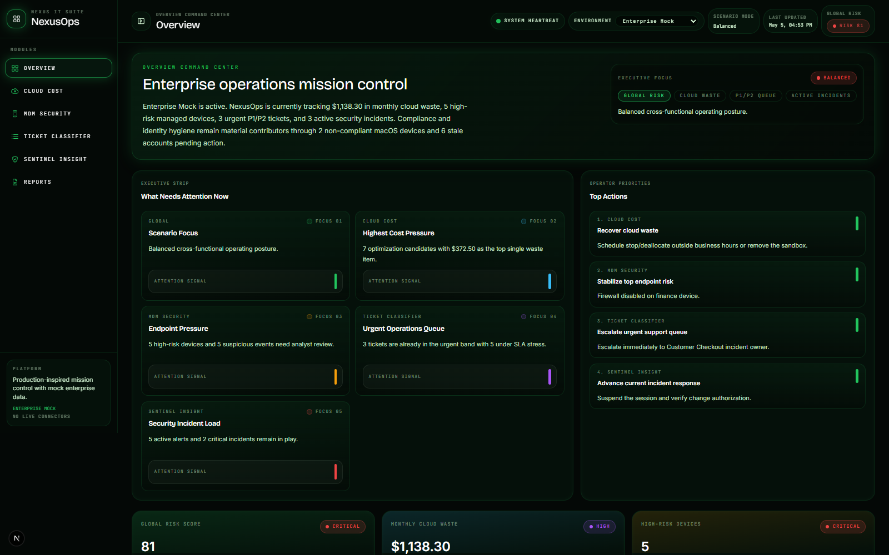
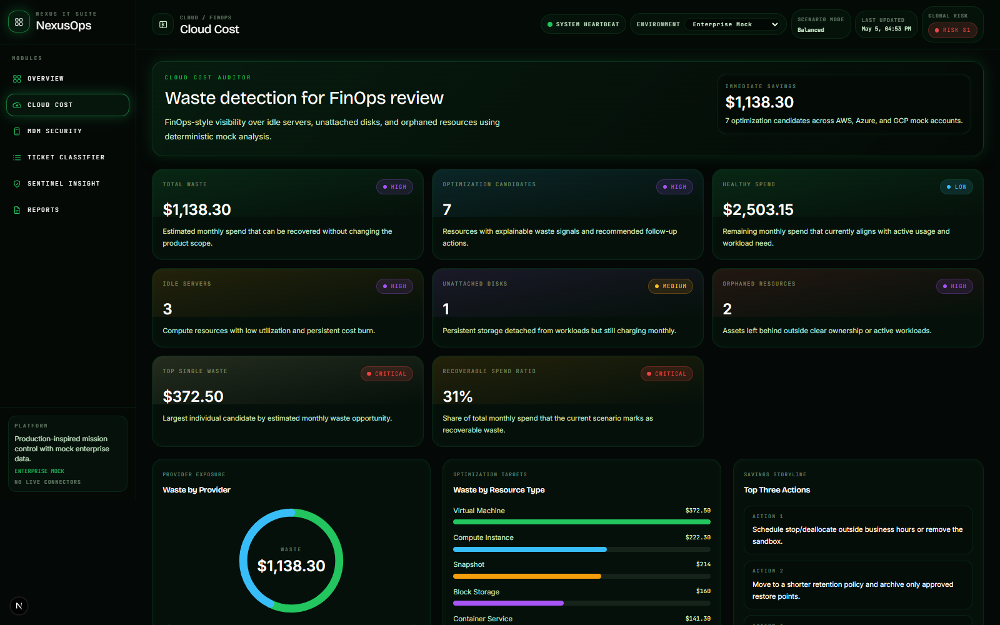
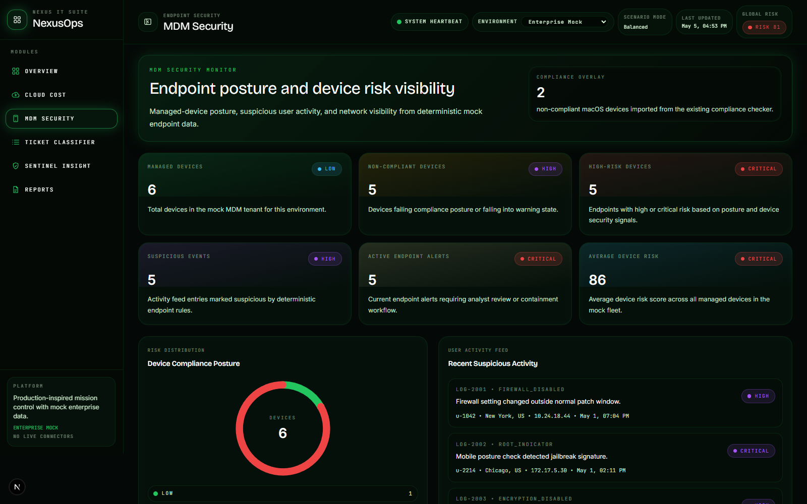
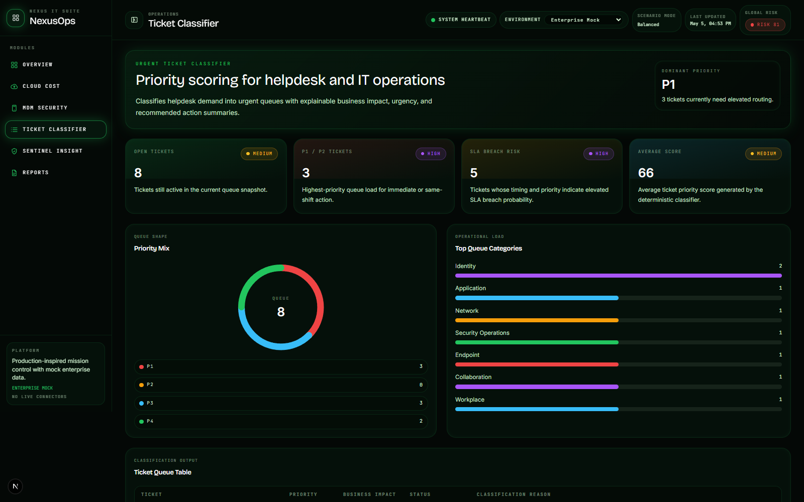
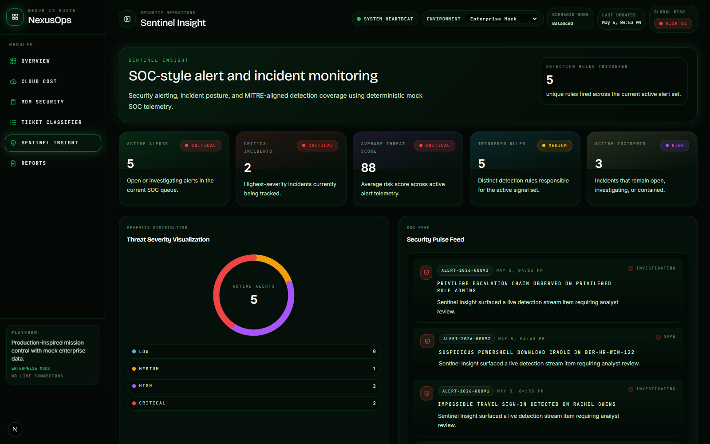
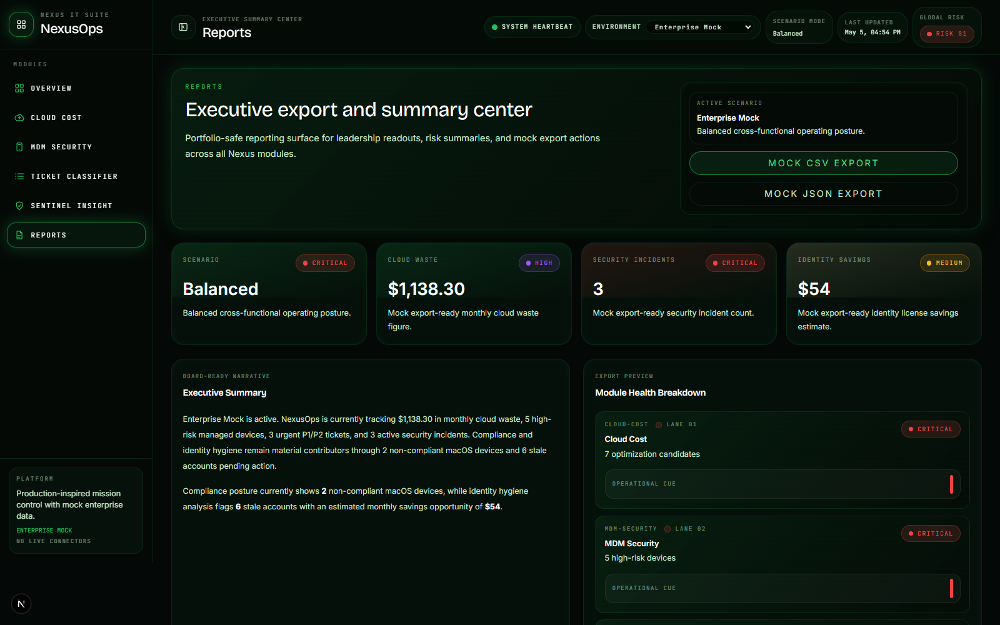
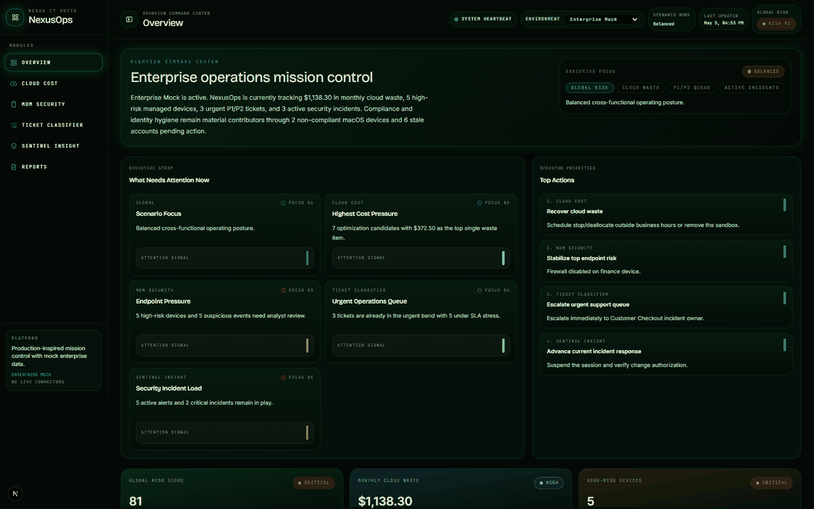

> A modular IT Operations and Security Operations Center dashboard that turns cloud waste, endpoint risk, urgent tickets, and security alerts into one executive-ready command center.

# Nexus IT Operations & Security Suite

NexusOps is a dark-mode mission-control dashboard for simulated IT and SOC operations. It combines FinOps, MDM security, ticket prioritization, and threat monitoring into one modular portfolio project.

## What This Is

Nexus IT Operations & Security Suite is a portfolio project that simulates a realistic enterprise IT operations platform using mock JSON and TypeScript-based datasets. It is intentionally built to feel like a serious internal operations product without claiming live production integrations.

- Modular dashboard architecture across multiple IT and security workflows
- Realistic IT/SOC operating scenarios and enterprise-style UI patterns
- Typed data models and deterministic analyzer logic
- Explainable scoring outputs with reasons instead of black-box decisions
- Mock enterprise datasets for cloud, endpoint, ticketing, and security workflows
- Dark technical interface designed for recruiter demos and architecture discussions

## The Problem

IT and security teams rarely work from a single operational picture.

- Cloud costs live in one system.
- Device compliance lives in another.
- Tickets live in another.
- Security alerts live in another.
- Managers and stakeholders often lack a unified view of operational risk, waste, and response priorities.

NexusOps models what a consolidated command center could look like: one modular interface that helps technical teams spot waste, understand risk, prioritize action, and communicate status more clearly.

## What It Does

- **Overview Command Center**: Pulls the most important signals into one executive-facing landing page so an engineer, manager, or interviewer can understand overall operational posture in seconds.
- **Cloud Cost Auditor**: Highlights estimated waste, optimization candidates, and provider-level spend issues to demonstrate FinOps thinking and cost-reduction visibility.
- **MDM Security Monitor**: Surfaces high-risk devices, compliance gaps, suspicious user activity, and network context to model endpoint security review workflows.
- **Urgent Ticket Classifier**: Scores the support queue using explainable logic so high-impact or SLA-sensitive tickets rise to the top with visible reasoning.
- **Sentinel Insight**: Frames security alerts and incident context in a SOC-style workflow with severity, rule context, and threat-oriented triage signals.
- **Reports**: Packages the suite into export-ready summaries and executive-style rollups to show how technical dashboards can support leadership communication.

## Business Value / Return on Insight

| Traditional IT Ops | NexusOps |
| --- | --- |
| Cloud waste visibility is buried inside billing portals and raw usage exports. | Estimated monthly waste is surfaced in a focused dashboard with optimization candidates and recommended actions. |
| Endpoint risk tracking is fragmented across device tools and ad hoc spreadsheets. | Risk-scored device health is centralized in one operational view. |
| Ticket prioritization often depends on manual queue review. | Explainable scoring highlights urgency, SLA risk, and business impact. |
| Security incident visibility is spread across alert consoles and analyst notes. | SOC-style alert context is presented in a clearer incident-oriented workflow. |
| Executive reporting is manual and time-consuming. | Summary cards and report views make status communication more presentation-ready. |
| Data models are often opaque to reviewers outside the team. | Typed mock datasets make inputs inspectable and easier to discuss in interviews. |
| Portfolio projects can feel like surface-level UI demos. | The suite is organized for explainability, architecture discussion, and business-value storytelling. |

## Screenshots

### Overview Command Center



Shows the main mission-control landing page with business-value insights, open operational load, recurring patterns, critical alerts, and a recruiter-friendly view of how multiple signals roll up into one command center.

### Cloud Cost Auditor



Demonstrates estimated monthly waste, provider and service breakdowns, optimization candidates, and action-oriented recommendations for cost reduction.

### MDM Security Monitor



Highlights device compliance posture, suspicious user activity, endpoint alert pressure, and the highest-risk managed devices in one endpoint security view.

### Urgent Ticket Classifier



Shows the scored ticket queue with visible priority levels, business impact, SLA sensitivity, and reasoning that explains why the most urgent tickets are ranked first.

### Sentinel Insight



Shows SOC-style alert monitoring with threat severity, active incidents, detection coverage, and MITRE-aligned security context.

### Reports



Packages the suite into an executive-ready summary with export concepts, module health, and leadership-facing risk narratives.

## GIF Preview



A short looping product preview that moves through Overview, Cloud Cost, MDM Security, Ticket Classifier, Sentinel Insight, and Reports in one recruiter-friendly README asset.

## Video Demo

Future long-form demo target: `docs/demo/nexusops-walkthrough.mp4`

[Watch the demo](https://your-demo-link-here)

Suggested longer walkthrough script:

1. Start on Overview and explain the command-center concept.
2. Call out the global risk score and why a unified top-level summary matters.
3. Open Cloud Cost Auditor and show estimated monthly waste plus optimization candidates.
4. Open MDM Security and show how high-risk devices are surfaced.
5. Open Ticket Classifier and explain P1 scoring, SLA risk, and business impact.
6. Open Sentinel Insight and show how alerts and incidents are framed for SOC-style triage.
7. Open Reports and explain executive summaries plus export-ready reporting intent.
8. End with the architecture story: modular routes, typed mock data, and explainable logic separated from UI.

## Recommended Recording Plan

### Screenshots To Capture

- Full Overview page
- Cloud Cost top section
- Cloud Cost table section
- MDM Security top section
- MDM Security tables
- Ticket Classifier queue
- Sentinel Insight alerts
- Reports page
- Sidebar navigation
- Command console

### Video Clips To Record

- 60 to 90 second full product walkthrough
- 15 second sidebar navigation clip
- 20 second Cloud Cost Auditor clip
- 20 second Sentinel Insight clip
- 20 second Ticket Classifier clip

### Recommended Tools

- OBS Studio
- Loom
- Screen Studio on macOS
- Windows Xbox Game Bar on Windows
- Browser screenshots for still captures

## Architecture

NexusOps is organized so UI, deterministic logic, and mock datasets stay clearly separated. That makes the project easier to explain in interviews and easier to evolve toward real integrations later.

```text
+---------------------------+
| Browser / Next.js App     |
| App Router pages          |
+-------------+-------------+
              |
              v
+---------------------------+
| React Components          |
| layout, charts, modules   |
+-------------+-------------+
              |
              v
+---------------------------+
| Module Dashboards         |
| overview, cloud, mdm,     |
| tickets, sentinel, report |
+-------------+-------------+
              |
              v
+---------------------------+
| Analyzer / Scoring Logic  |
| frontend/src/lib/*        |
+-------------+-------------+
              |
              v
+---------------------------+
| Mock JSON / TS Data       |
| frontend/src/data/mock/*  |
+---------------------------+
```

- UI components are separate from scoring and rule logic.
- Deterministic logic lives in `frontend/src/lib/`.
- Mock datasets live in `frontend/src/data/mock/`.
- Each module is intended to be independently explainable during review.

## Project Structure

The frontend is centered in `frontend/src`, with supporting documentation assets stored under `docs/`.

```text
frontend/src/
  app/
  components/
  lib/
  data/mock/
  data/policies/

docs/
  assets/
  demo/
```

## Stack And Key Decisions

- **Next.js App Router** for route-based modular dashboards
- **React** for composable module views and reusable UI
- **TypeScript** for typed models, analyzers, and clearer architecture discussions
- **Tailwind CSS** for fast iteration on the dark-mode command-center interface
- **Mock JSON and TypeScript fixtures** instead of live integrations at this stage
- **SVG and lightweight chart components** for dashboard-style visuals
- **Modular architecture** so each domain can evolve independently
- **No auth, database, or external API integrations yet by design** to keep the portfolio scope focused and honest

## Run Locally

```bash
git clone <your-repo-url>
cd it-incident-intelligence-main
cd frontend
npm install
npm run dev
```

Production build check:

```bash
npm run build
```

## Before And After

| Disconnected IT tooling | NexusOps |
| --- | --- |
| Separate dashboards for cost, endpoint, ticketing, and security workflows | Unified command center with shared operational context |
| Manual triage and subjective queue review | Explainable ticket scoring with visible reasons |
| Hidden cloud waste inside billing data | Monthly savings visibility with optimization candidates |
| Raw alerts without clear operational framing | SOC-style incident and severity views |
| Static portfolio mockups | Modular, working dashboard architecture |

## AI-Assisted Development Note

This project was built as a portfolio project using AI-assisted development workflows, with the final architecture organized around modular routes, reusable components, typed mock data, and explainable scoring logic.

## What's Next

- Connect real AWS or Azure cost APIs
- Add Jamf or Intune-style device ingestion
- Add Jira or ServiceNow ticket ingestion
- Add SIEM or Microsoft Sentinel-style alert ingestion
- Add PDF and CSV report export
- Add authentication
- Add database persistence

## Contact

**Frederick Mendez**  
GitHub: [https://github.com/frederickmendez](https://github.com/frederickmendez)  
LinkedIn: [https://www.linkedin.com/in/frederickmendez](https://www.linkedin.com/in/frederickmendez)

## Portfolio Disclaimer

Built as a portfolio project to demonstrate frontend architecture, IT operations workflows, security dashboard design, and AI-assisted product development.
